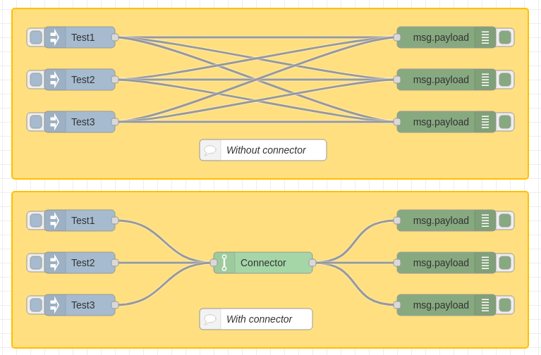

# Node-RED Connector
A connector node for node-red

## Description
Sympli do nothing, just connect other node.

## Screenshot


## Flow

```
[
    {
        "id": "6195c3c10d7e7099",
        "type": "tab",
        "label": "Connector",
        "disabled": false,
        "info": "",
        "env": []
    },
    {
        "id": "6d3704f7b3bc46ac",
        "type": "group",
        "z": "6195c3c10d7e7099",
        "name": "",
        "style": {
            "stroke": "#ffC000",
            "label": true,
            "fill": "#ffdf7f"
        },
        "nodes": [
            "44966ed44ce1850a",
            "8ca0a6574b3880b5",
            "97270de3d75418cf",
            "c43df2b08b5c2bd7",
            "aad589ea76eda4f4",
            "123010dfe3026bee",
            "dcae57a069bc5d58"
        ],
        "x": 94,
        "y": 59,
        "w": 732,
        "h": 242
    },
    {
        "id": "974bc7d13544e95d",
        "type": "group",
        "z": "6195c3c10d7e7099",
        "name": "",
        "style": {
            "stroke": "#ffC000",
            "label": true,
            "fill": "#ffdf7f"
        },
        "nodes": [
            "9eec96d685d5303e",
            "9e738eb7819aaca3",
            "00a365891f85c921",
            "465409b45b36b44b",
            "78ffb7690ab22471",
            "12691c9dbc046734",
            "3c7828d108a0304e",
            "a8e939b3ab608e83"
        ],
        "x": 94,
        "y": 319,
        "w": 732,
        "h": 222
    },
    {
        "id": "44966ed44ce1850a",
        "type": "inject",
        "z": "6195c3c10d7e7099",
        "g": "6d3704f7b3bc46ac",
        "name": "",
        "props": [
            {
                "p": "payload"
            },
            {
                "p": "topic",
                "vt": "str"
            }
        ],
        "repeat": "",
        "crontab": "",
        "once": false,
        "onceDelay": 0.1,
        "topic": "",
        "payload": "Test1",
        "payloadType": "str",
        "x": 190,
        "y": 100,
        "wires": [
            [
                "8ca0a6574b3880b5",
                "c43df2b08b5c2bd7",
                "97270de3d75418cf"
            ]
        ]
    },
    {
        "id": "8ca0a6574b3880b5",
        "type": "debug",
        "z": "6195c3c10d7e7099",
        "g": "6d3704f7b3bc46ac",
        "name": "",
        "active": true,
        "tosidebar": true,
        "console": false,
        "tostatus": false,
        "complete": "false",
        "statusVal": "",
        "statusType": "auto",
        "x": 710,
        "y": 100,
        "wires": []
    },
    {
        "id": "97270de3d75418cf",
        "type": "debug",
        "z": "6195c3c10d7e7099",
        "g": "6d3704f7b3bc46ac",
        "name": "",
        "active": true,
        "tosidebar": true,
        "console": false,
        "tostatus": false,
        "complete": "false",
        "statusVal": "",
        "statusType": "auto",
        "x": 710,
        "y": 220,
        "wires": []
    },
    {
        "id": "c43df2b08b5c2bd7",
        "type": "debug",
        "z": "6195c3c10d7e7099",
        "g": "6d3704f7b3bc46ac",
        "name": "",
        "active": true,
        "tosidebar": true,
        "console": false,
        "tostatus": false,
        "complete": "false",
        "statusVal": "",
        "statusType": "auto",
        "x": 710,
        "y": 160,
        "wires": []
    },
    {
        "id": "aad589ea76eda4f4",
        "type": "inject",
        "z": "6195c3c10d7e7099",
        "g": "6d3704f7b3bc46ac",
        "name": "",
        "props": [
            {
                "p": "payload"
            },
            {
                "p": "topic",
                "vt": "str"
            }
        ],
        "repeat": "",
        "crontab": "",
        "once": false,
        "onceDelay": 0.1,
        "topic": "",
        "payload": "Test2",
        "payloadType": "str",
        "x": 190,
        "y": 160,
        "wires": [
            [
                "8ca0a6574b3880b5",
                "c43df2b08b5c2bd7",
                "97270de3d75418cf"
            ]
        ]
    },
    {
        "id": "123010dfe3026bee",
        "type": "inject",
        "z": "6195c3c10d7e7099",
        "g": "6d3704f7b3bc46ac",
        "name": "",
        "props": [
            {
                "p": "payload"
            },
            {
                "p": "topic",
                "vt": "str"
            }
        ],
        "repeat": "",
        "crontab": "",
        "once": false,
        "onceDelay": 0.1,
        "topic": "",
        "payload": "Test3",
        "payloadType": "str",
        "x": 190,
        "y": 220,
        "wires": [
            [
                "8ca0a6574b3880b5",
                "c43df2b08b5c2bd7",
                "97270de3d75418cf"
            ]
        ]
    },
    {
        "id": "9eec96d685d5303e",
        "type": "Connector",
        "z": "6195c3c10d7e7099",
        "g": "974bc7d13544e95d",
        "name": "",
        "x": 450,
        "y": 420,
        "wires": [
            [
                "00a365891f85c921",
                "465409b45b36b44b",
                "78ffb7690ab22471"
            ]
        ]
    },
    {
        "id": "9e738eb7819aaca3",
        "type": "inject",
        "z": "6195c3c10d7e7099",
        "g": "974bc7d13544e95d",
        "name": "",
        "props": [
            {
                "p": "payload"
            },
            {
                "p": "topic",
                "vt": "str"
            }
        ],
        "repeat": "",
        "crontab": "",
        "once": false,
        "onceDelay": 0.1,
        "topic": "",
        "payload": "Test1",
        "payloadType": "str",
        "x": 190,
        "y": 360,
        "wires": [
            [
                "9eec96d685d5303e"
            ]
        ]
    },
    {
        "id": "00a365891f85c921",
        "type": "debug",
        "z": "6195c3c10d7e7099",
        "g": "974bc7d13544e95d",
        "name": "",
        "active": true,
        "tosidebar": true,
        "console": false,
        "tostatus": false,
        "complete": "false",
        "statusVal": "",
        "statusType": "auto",
        "x": 710,
        "y": 360,
        "wires": []
    },
    {
        "id": "465409b45b36b44b",
        "type": "debug",
        "z": "6195c3c10d7e7099",
        "g": "974bc7d13544e95d",
        "name": "",
        "active": true,
        "tosidebar": true,
        "console": false,
        "tostatus": false,
        "complete": "false",
        "statusVal": "",
        "statusType": "auto",
        "x": 710,
        "y": 480,
        "wires": []
    },
    {
        "id": "78ffb7690ab22471",
        "type": "debug",
        "z": "6195c3c10d7e7099",
        "g": "974bc7d13544e95d",
        "name": "",
        "active": true,
        "tosidebar": true,
        "console": false,
        "tostatus": false,
        "complete": "false",
        "statusVal": "",
        "statusType": "auto",
        "x": 710,
        "y": 420,
        "wires": []
    },
    {
        "id": "12691c9dbc046734",
        "type": "inject",
        "z": "6195c3c10d7e7099",
        "g": "974bc7d13544e95d",
        "name": "",
        "props": [
            {
                "p": "payload"
            },
            {
                "p": "topic",
                "vt": "str"
            }
        ],
        "repeat": "",
        "crontab": "",
        "once": false,
        "onceDelay": 0.1,
        "topic": "",
        "payload": "Test2",
        "payloadType": "str",
        "x": 190,
        "y": 420,
        "wires": [
            [
                "9eec96d685d5303e"
            ]
        ]
    },
    {
        "id": "3c7828d108a0304e",
        "type": "inject",
        "z": "6195c3c10d7e7099",
        "g": "974bc7d13544e95d",
        "name": "",
        "props": [
            {
                "p": "payload"
            },
            {
                "p": "topic",
                "vt": "str"
            }
        ],
        "repeat": "",
        "crontab": "",
        "once": false,
        "onceDelay": 0.1,
        "topic": "",
        "payload": "Test3",
        "payloadType": "str",
        "x": 190,
        "y": 480,
        "wires": [
            [
                "9eec96d685d5303e"
            ]
        ]
    },
    {
        "id": "dcae57a069bc5d58",
        "type": "comment",
        "z": "6195c3c10d7e7099",
        "g": "6d3704f7b3bc46ac",
        "name": "Without connector",
        "info": "",
        "x": 450,
        "y": 260,
        "wires": []
    },
    {
        "id": "a8e939b3ab608e83",
        "type": "comment",
        "z": "6195c3c10d7e7099",
        "g": "974bc7d13544e95d",
        "name": "With connector",
        "info": "",
        "x": 440,
        "y": 500,
        "wires": []
    }
]
```
